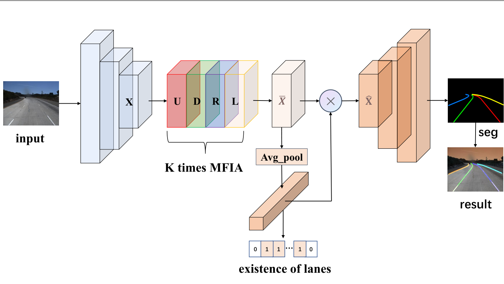

# MFIALane
PyTorch implementation of the paper "[MFIALane: Multi-scale Feature Information
Aggregator Network for Lane Detection]". 
Good news! ! ! Our paper was accepted by IEEE Transactions on Intelligent Transportation Systems.


## VIL-100 demo
https://user-images.githubusercontent.com/39958763/162392004-0dbfcfb9-ee63-4a9d-8a79-0414043ee3de.mp4


## Introduction

- MFIALane achieves SOTA results on VIL-100, CULane, and Tusimple Dataset.

## Get started
1. Clone the MFIALane repository
    ```
    git clone https://github.com/Cuibaby/MFIALane.git
    ```
    We call this directory as `$MFIALane_ROOT`

2. Create a conda virtual environment and activate it (conda is optional)

    ```Shell
    conda create -n MFIALane python=3.8 -y
    conda activate MFIALane
    ```

3. Install dependencies

    ```Shell
    # Install pytorch firstly, the cudatoolkit version should be same in your system. (you can also use pip to install pytorch and torchvision)
    conda install pytorch torchvision cudatoolkit=10.1 -c pytorch

    # Or you can install via pip
    pip install torch torchvision

    # Install python packages
    pip install -r requirements.txt
    ```

4. Data preparation

    Download [VIL-100](https://github.com/yujun0-0/MMA-Net/tree/main/dataset), [CULane](https://xingangpan.github.io/projects/CULane.html) and [Tusimple](https://github.com/TuSimple/tusimple-benchmark/issues/3). Then extract them to  `$VIL-100ROOT` `$CULANEROOT` and `$TUSIMPLEROOT`. Create link to `data` directory.
    
    ```Shell
    cd $MFIALane_ROOT
    mkdir -p data
    ln -s $VIL-100ROOT data/VIL-100
    ln -s $CULANEROOT data/CULane
    ln -s $TUSIMPLEROOT data/tusimple
    ```

    For CULane, you should have structure like this:
    ```
    $CULANEROOT/driver_xx_xxframe    # data folders x6
    $CULANEROOT/laneseg_label_w16    # lane segmentation labels
    $CULANEROOT/list                 # data lists
    ```

    For Tusimple, you should have structure like this:
    ```
    $TUSIMPLEROOT/clips # data folders
    $TUSIMPLEROOT/lable_data_xxxx.json # label json file x4
    $TUSIMPLEROOT/test_tasks_0627.json # test tasks json file
    $TUSIMPLEROOT/test_label.json # test label json file

    ```

    For Tusimple, the segmentation annotation is not provided, hence we need to generate segmentation from the json annotation. 

    ```Shell
    python tools/generate_seg_tusimple.py --root $TUSIMPLEROOT
    # this will generate seg_label directory
    ```

5. Install CULane evaluation tools. 

    This tools requires OpenCV C++. Please follow [here](https://docs.opencv.org/master/d7/d9f/tutorial_linux_install.html) to install OpenCV C++.  Or just install opencv with command `sudo apt-get install libopencv-dev`

    
    Then compile the evaluation tool of CULane.
    ```Shell
    cd $MFIALane_ROOT/runner/evaluator/culane/lane_evaluation
    make
    cd -
    ```
    
    Note that, the default `opencv` version is 3. If you use opencv2, please modify the `OPENCV_VERSION := 3` to `OPENCV_VERSION := 2` in the `Makefile`.


## Training

For training, run

```Shell
python main.py [configs/path_to_your_config] --gpus [gpu_ids]
```


For example, run
```Shell
python main.py configs/culane.py --gpus 0 1 2 3
```

## Testing
For testing, run
```Shell
python main.py c[configs/path_to_your_config] --validate --load_from [path_to_your_model] [gpu_num]
```

For example, run
```Shell
python main.py configs/culane.py --validate --load_from culane_resnet50.pth --gpus 0 1 2 3

python main.py configs/tusimple.py --validate --load_from tusimple_resnet34.pth --gpus 0 1 2 3
```


We provide two trained ResNet models on VIL-100, CULane and Tusimple, downloading our best performed model(comming soon).
<!-- (Tusimple: [GoogleDrive](https://drive.google.com/file/d/1M1xi82y0RoWUwYYG9LmZHXWSD2D60o0D/view?usp=sharing)/[BaiduDrive(code:s5ii)](https://pan.baidu.com/s/1CgJFrt9OHe-RUNooPpHRGA),
CULane: [GoogleDrive](https://drive.google.com/file/d/1pcqq9lpJ4ixJgFVFndlPe42VgVsjgn0Q/view?usp=sharing)/[BaiduDrive(code:rlwj)](https://pan.baidu.com/s/1ODKAZxpKrZIPXyaNnxcV3g), VIL-100: [GoogleDrive](https://drive.google.com/file/d/1M1xi82y0RoWUwYYG9LmZHXWSD2D60o0D/view?usp=sharing)/[BaiduDrive(code:s5ii)](https://pan.baidu.com/s/1CgJFrt9OHe-RUNooPpHRGA)
) -->

## Visualization
Just add `--view`.

For example:
```Shell
python main.py configs/culane.py --validate --load_from culane_resnet50.pth --gpus 0 1 2 3 --view
```
You will get the result in the directory: `work_dirs/[DATASET]/xxx/vis`.

## Citation

```BibTeX
@ARTICLE{9872124,  
author={Qiu, Zengyu and Zhao, Jing and Sun, Shiliang},  
journal={IEEE Transactions on Intelligent Transportation Systems},   
title={MFIALane: Multiscale Feature Information Aggregator Network for Lane Detection},   
year={2022},  
volume={},  
number={},  
pages={1-13},  
doi={10.1109/TITS.2022.3195742}
}
```

## Thanks

The code is modified from [SCNN](https://github.com/XingangPan/SCNN), [Tusimple Benchmark](https://github.com/TuSimple/tusimple-benchmark) and [RESA](https://github.com/zjulearning/resa.git). It's also recommended for you to try  [LaneDet](https://github.com/Turoad/lanedet). 
